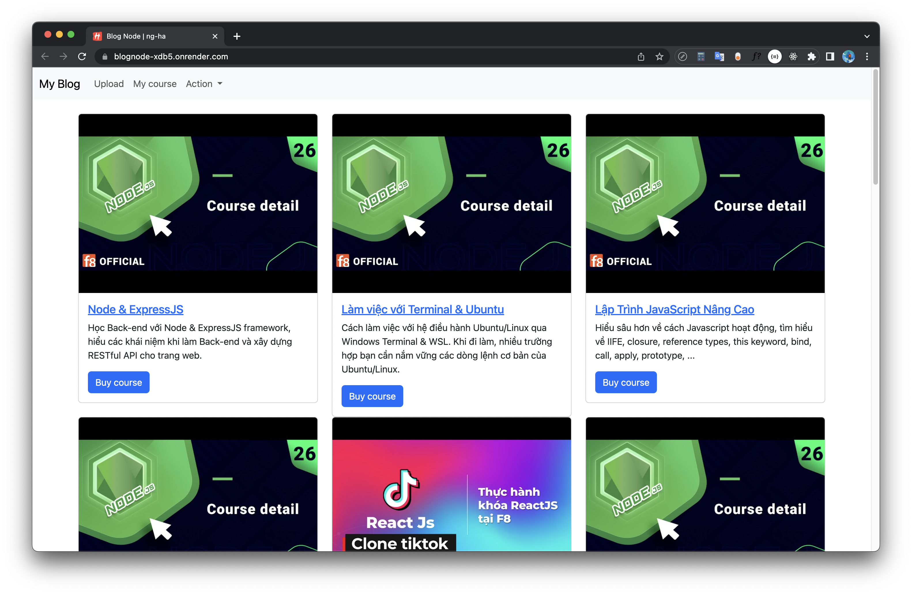

# A ExpressJs server with Handlebars template engine 📝

### Link Demo 📌

[https://blognode-xdb5.onrender.com](https://blognode-xdb5.onrender.com)

### Technologies ✨

- NodeJs
- ExpressJs
- Express-handlebars
- MongoBD with mongoose
- Docker

### License :right_anger_bubble:

[MIT](https://choosealicense.com/licenses/mit/)
